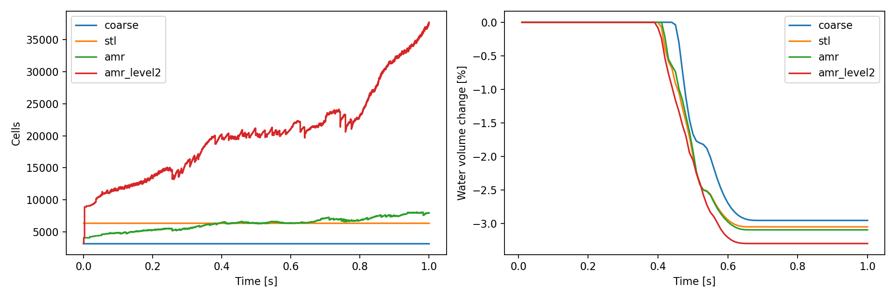
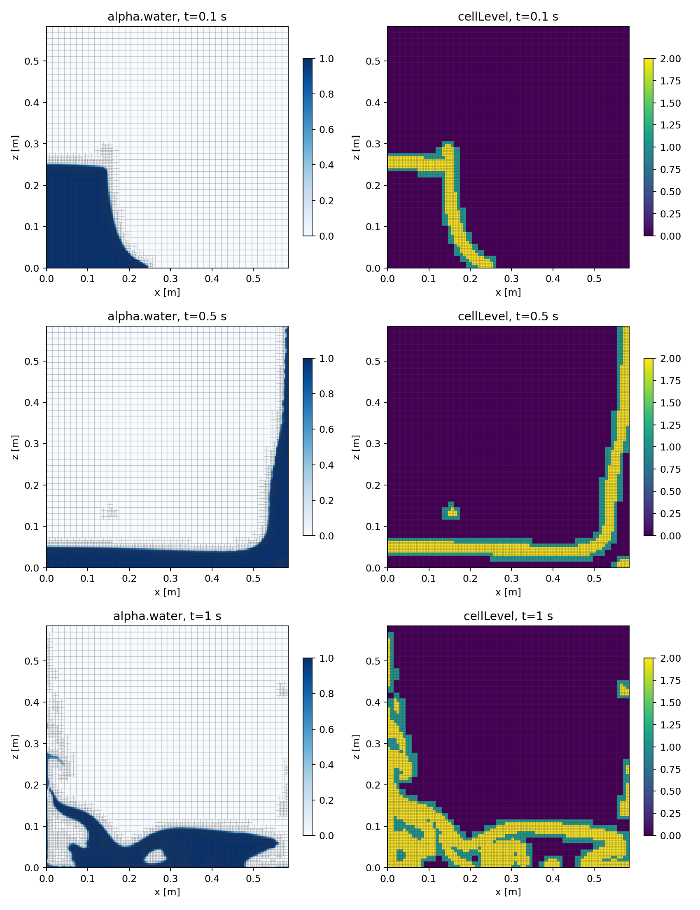
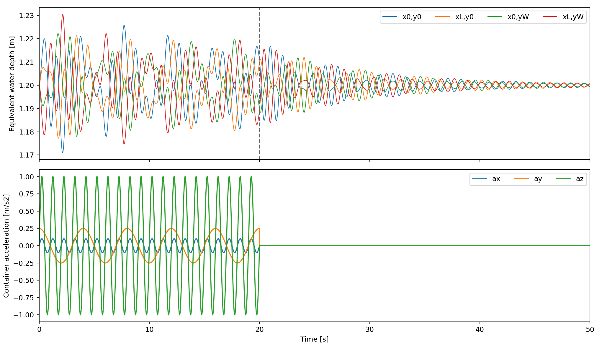
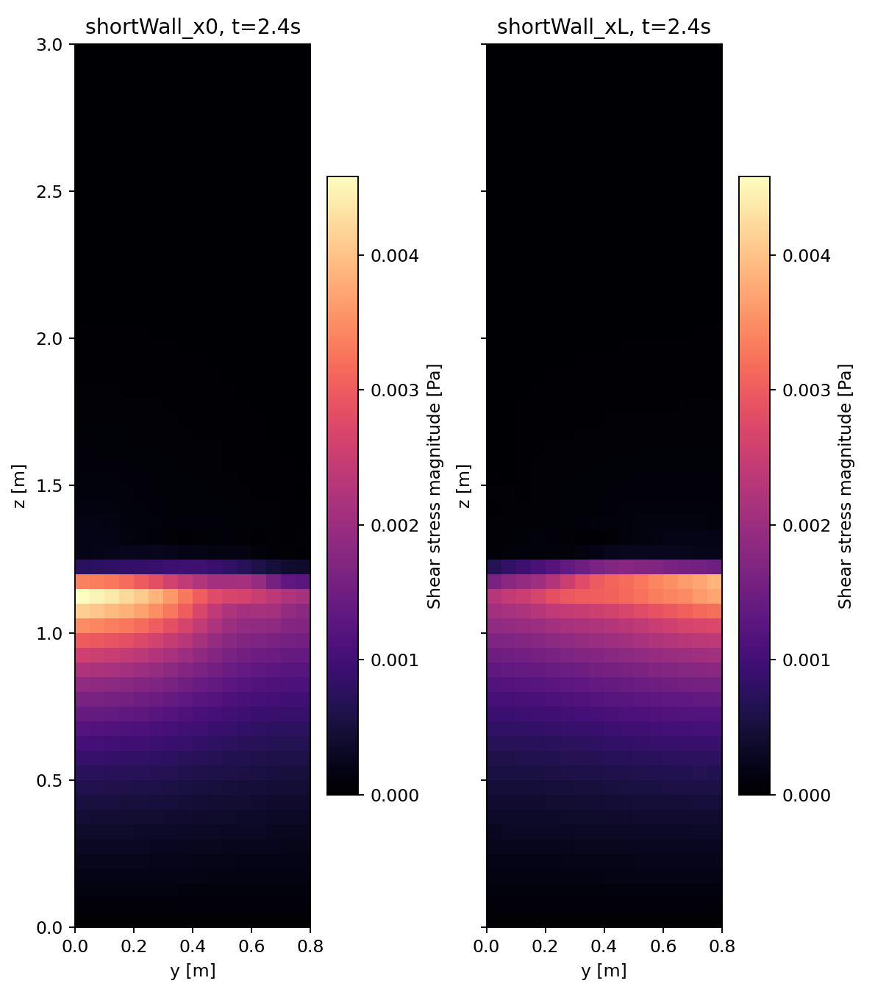

# interFoam検証結果・ChatGPT Work引き継ぎ（2026-09-06）

## 結論

STL初期水域のdamBreak、CSVスロッシング50秒、界面適合細分化damBreakの全ケースを、HTMLの入力・生成処理から出力してOpenCFD OpenFOAM v2412 patch=260127で実行した。辞書への手動追記は行っていない。HTMLを修正し、再読込可能なプロジェクトと再生成スクリプトを用意した。GUI・生成物の回帰テストは136件すべて成功。

VOFの移流設定と自動細分化で実際に計算を阻害する不具合を2件再現し、修正後の完走を確認した。pisoFoamの検証は今回の対象外。

## 修正すべきだった箇所と対応

1. **VOF運動量移流**：従来はGUIの選択に関係なく `div(rhoPhi,U) bounded Gauss limitedLinearV 1` を出力していた。STL damBreakで約0.0494秒からdtが約9e-8秒に低下した。GUIのU移流スキームを反映し、保存形のVOF運動量式にはbounded接頭辞を付けないよう修正。同じlimitedLinearVで接頭辞だけを除いた再実行は1秒完走。失敗ログは `damBreak_stl_bounded_failed/` に保持。
2. **自動細分化直後の停止**：`checkMeshCourantNo yes` により、トポロジーだけを変えるAMRでも移動メッシュのfluxを参照し `mesh flux field does not exist` で異常終了した。AMI・剛体回転だけyes、固定メッシュ・AMRではnoへ変更。`alphaPhiUn` のflux mappingも補完。失敗ログは `damBreak_amr_meshflux_failed/` に保持。
3. **AMRの2次元境界**：3方向に細分化するdynamicRefineFvMeshとempty境界の組合せをHTMLで拒否するよう追加。検証用の薄い3次元メッシュは前後対称・厚み2セル。対称境界でも厚み1セルでは初期checkMeshのdeterminant検査に失敗したため採用しなかった。
4. **加速度20秒／解析50秒**：入力CSVの意味と明示的なゼロ末尾追加をGUI化。元CSV、変換後container.csv、変換条件conversion.jsonを出力。今回の選択は「重力を含まない容器加速度」。重力は別途 (0 0 -9.81) m/s² とし全時間で維持。
5. **波高・壁面分布**：GUIからinterfaceHeight、対象壁のwallShearStress/rho/alpha.waterのVTK出力を設定可能にした。存在しない壁・壁でない対象をHTMLと実メッシュ検査で拒否。
6. **波高測線の探索**：隅角に近い測線のx=y配置では最初の測点がhL=1e15となった。5 mmだけ内側へ動かしても対角線上では再現した。xとyの位置をずらした最終4測線は全時刻で有限・有効な値。HTMLの説明にも注意を追記。

## damBreakと自動細分化

障害物なし矩形領域0.584 × 0.0146 × 0.584 m、上面大気開放。水柱はSTLからsearchableSurfaceToCellで選択。初期水量は約0.0006224272 m³。固定2次元ケースは6400セル中800セル、比較用3次元ケースは3200セル中400セルをalpha.water=1にした。boxToCellは不使用。

| ケース | 初期→最終セル数 | 計算途中の最大セル数 | 最終水量変化 | 終了時刻 |
|---|---:|---:|---:|---:|
| damBreak_coarse | 3,200 → 3,200 | 3,200 | -2.9564% | 1 s |
| damBreak_stl | 6,400 → 6,400 | 6,400 | -3.0521% | 1 s |
| damBreak_amr | 3,200 → 7,953 | 8,072 | -3.0968% | 1 s |
| damBreak_amr_level2 | 3,200 → 37,570 | 37,703 | -3.3007% | 1 s |

AMRは5ステップごと、alpha判定0.001〜0.999、最大100000セル、最大追加レベル1または2。1段階では細分化479回・粗視化247回、2段階では細分化1176回・粗視化838回を記録。2段階の0.5秒時点は20273セルで、判定範囲内の界面9058セルの100%がレベル2にある。界面に合わせた細分化と、界面通過後の粗視化の両方が動作した。

水量は全ケースで約3%減少するが、上面が開いており、保存したalphaPhi0.waterで上面から水の流出を確認した。固定2次元ケースの0.05秒間隔流束の台形積分は約1.96e-5 m³、体積減少は約1.90e-5 m³。これは閉容器の水量保存試験ではなく、時間離散化・流出・AMR写像の誤差を分離した厳密収支でもない。越流しない条件での水量保持は次のスロッシングで別途確認した。

### AMR後のメッシュ検査の扱い

通常のcheckMeshは通過。`-allTopology -allGeometry` は粗密境界の同一平面上にある分割面もconcave判定する。v2412 `primitiveMeshCheck.C` の `checkConcaveCells` は `(pC & fN) > -1e-6` を用い、ソースコメントも `Concave or planar face` となっている。これを単に「全項目合格」とは報告しない。

1段階の1秒・2段階の0.5秒について独立に全セルを調べ、各面がセル外接直方体の6平面上にあること（最大ずれ0 m）と、体積が外接直方体体積に一致すること（最大相対差6.7e-16）を確認した。今回の平面分割による指摘と、一般STLメッシュの本当の凹セルを混同しないこと。初期メッシュの厳格な停止ゲートは緩めていない。

## スロッシング

長手x=1.2 m、短手y=0.8 m、高さz=3 m、初期水深1.2 m、上面大気開放。24 × 16 × 60セル、層流。初期水量1.152 m³をSTLで設定。

CSVは0〜20秒・0.01秒刻みの2001サンプル。ax=0.1sin(2πt)、ay=0.25cos(πt/2)、az=sin(2πt) [m/s²]。CSVに重力を入れず、基準重力 (0 0 -9.81) m/s² は全時間に存在する。固定容器座標系のソースがgEffective=g−aContainerを適用。

20秒の元サンプルは保持し、20.01秒からゼロのサンプルを追加する。ay(20)=0.25であり、終了時の0.01秒はゼロへの移行区間となる。v2412はスプライン補間するため、その直近には補間のオーバーシュートがあり得る。実行ログで20.02秒以降の容器加速度が全成分0であることを確認。テーブルは50.02秒まで用意し、解析は50秒で正常終了した。

- 最終水量: 1.1519989548 m³、初期からの変化 -9.0729167e-05%。
- 全計算中のalpha範囲: -4.8148e-37 〜 1.00015368。
- 波高時刻歴: 5000行、4測点とも無効値なし。
- 各測点の水深最小値: 1.170961, 1.177212, 1.177949, 1.174667 m。
- 各測点の水深最大値: 1.225788, 1.221309, 1.222206, 1.230435 m。
- 壁面VTK: 1000ファイル、各壁960面。Pa換算後の全時刻・両壁の最大せん断応力の大きさは約0.00457912 Pa（2.4秒、shortWall_x0）。これは粗格子・層流の機能検証結果であり、設計用の壁応力精度を保証しない。

### 早期停止の判断

途中で「収束していれば止めてよい」との指示を受けたが、30〜35秒でも4点の最大の波高全振幅が約10 mmあったため静止とは判断せず、当初の50秒まで実行した。時間ステップ内の残差収束と自由表面の振動減衰は別の判定である。

| 区間 | 4点のうち最大の波高全振幅 |
|---|---:|
| 20〜25 s | 32.104 mm |
| 25〜30 s | 17.548 mm |
| 30〜35 s | 10.050 mm |
| 35〜40 s | 6.678 mm |
| 40〜45 s | 4.307 mm |
| 45〜50 s | 2.689 mm |

測線は隅角からx方向5 mm、y方向7 mm内側、測点z=0.025 m、計測方向は固定の下向き(0 0 -1)。`height.dat`のhBを底面からの水深として使用する。alphaの線積分による等価水深であり、飛沫を含む最高波頂ではない。

対象壁は短手方向に平行なx=0、x=1.2のy-z面。OpenFOAMのwallShearStressは動粘性基準[m²/s²]なので同じ面のrhoを掛け、Pa換算したVTKも別に作成した。ベクトルの符号はOpenFOAMの定義を維持。

## 引き継ぎと再現

- HTML、src、tests、examples/interfoam、scripts/generate-interfoam.cjs が変更対象。ソースからbuildした単体HTMLを使う。
- examples/interfoam/README.md に全条件・操作・再生成手順を記載。全設定はプロジェクトJSONからHTMLへ復元可能。
- ローカルの interFoam_validation/ にケース本体、ログ、失敗試行、results/ のCSV・図・Pa換算VTKを保存。
- 成功条件は対象例での生成・実行・観測・細分化動作。メッシュ独立性、時間刻み独立性、乱流モデルや壁面解像度の選定、実験照合は未実施。
- pisoFoamと、今回の加速度入力＋AMRの同時使用は未検証。現HTMLは加速度を固定メッシュに限定する。

参照: OpenCFD v2412インストール内のinterFoam、tabulatedAccelerationSource、interfaceHeight、wallShearStress、dynamicRefineFvMesh、primitiveMeshCheck.C。公開説明: [加速度ソース](https://doc.openfoam.com/2312/tools/processing/numerics/fvoptions/sources/rtm/tabulatedAcceleration/)、[interfaceHeight](https://doc.openfoam.com/2212/tools/post-processing/function-objects/field/interfaceHeight/)。
